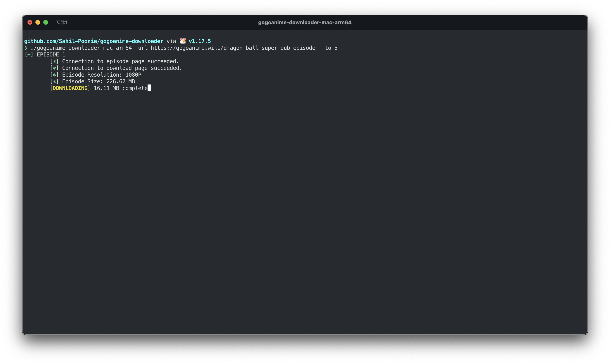

# gogoanime-downloader 

gogoanime-downloader is a simple Go program to scrape and download a range of anime episodes from [gogoanime.wiki](https://gogoanime.wiki/)

## Usage 🏄‍♂️

```text
Usage of ./gogoanime-downloader-mac-arm64:
  -from int
    	episode number you want to download from. (default 1)
  -to int
    	episode number you want to download to. (default 1)
  -url string
    	URL of episode page but without episode number.
    	(ex: 'https://gogoanime.wiki/dragon-ball-super-dub-episode-' Note that link does not contain
    	episode number at the end )
```

it's pretty simple to use and should be very clear from help menu.

## Screenshots 📺



## Contributing 🧑🏻‍💻

If you want to add any new feature or improve the code or improve the project readme or any kind of help in genral would be great.

open for PRs and everybody is welcome 🤗

## License 📃

To be honest about it, I don't care. anyone can use it however they want. it's just a simple program I made while learning Go.

Thanks for your visit 🤗
